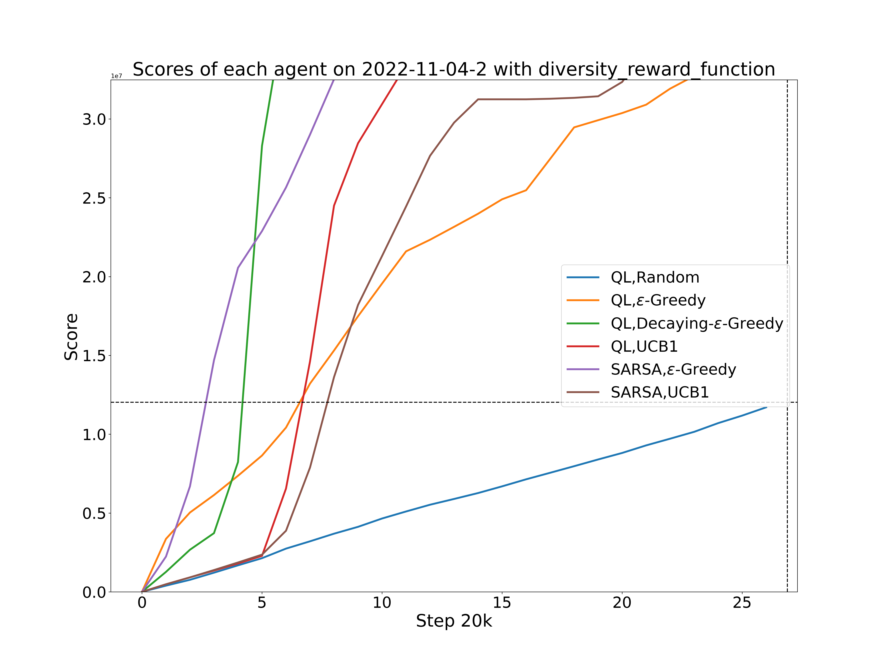
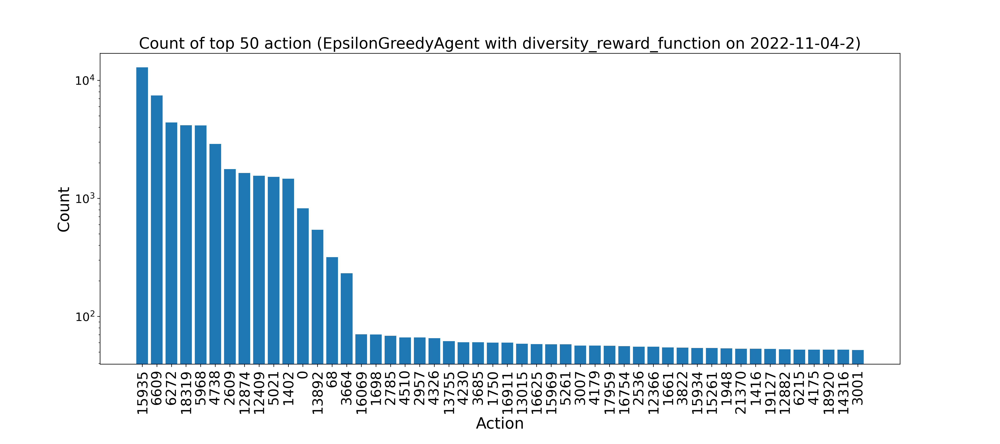
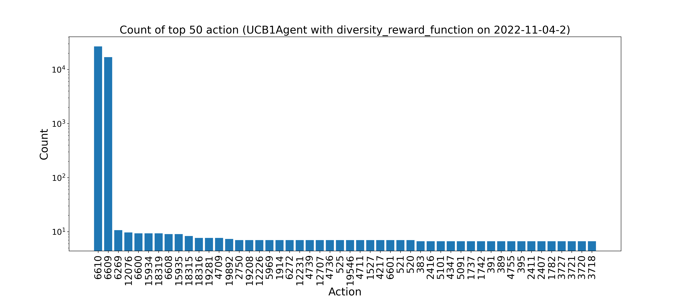
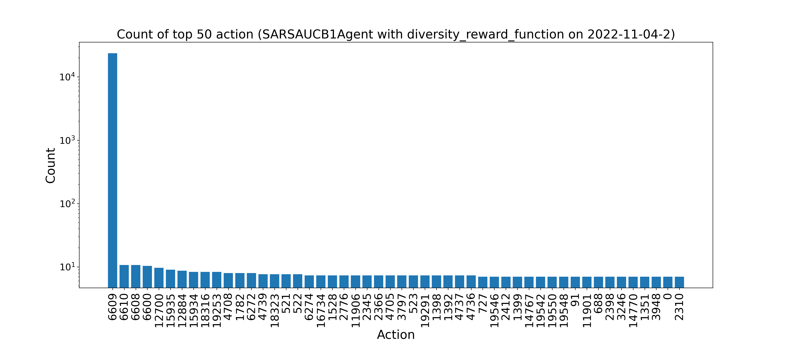

# Rapid Calibration of a Cellular-Resolution Bidirectional Neural Interface (RCCRBNI)  

## Abstract
Epiretinal implants are intended to restore vision to people blinded by retinal degeneration by electrically stimulating surviving retinal ganglion cells (RGCs) to convey artificial visual signals to the brain. Reproducing the rich spatio-temporal patterns of visually evoked RGC responses requires stimulation through many electrodes, each of which must be calibrated to the unique geometric and electrical properties of an individual retina. Here we evaluate a model-free reinforcement learning approach to decrease the time required to calibrate a useful subset of electrical stimuli. Using simulations of experiments administered to ex vivo retinal preparations, we find that the optimized approach offers similar calibration performance to an exhaustive single-electrode calibration in less than 20\% of the time. We plan to continue developing this framework to deploy in real time during future experiments.

## Result  
<!-- Display two plots in table -->
### Score Comparison for 2022-11-04-2 and 2022-11-28-1 Dataset with Diversity Reward Function
<table>
    <tr>
        <!-- add caption to each image -->
        <td>Score for 2022-11-04-2 Dataset</td>
        <td>Score for 2022-11-28-1 Dataset</td>
    </tr>
    <tr>
        <!-- add image to each cell -->
        <td></td>
        <td></td>
    </tr>
</table>

### Score Comparison for 2022-11-04-2 and 2022-11-28-1 Dataset with Inverse Reward Function
<table>
    <tr>
        <!-- add caption to each image -->
        <td>Score for 2022-11-04-2 Dataset</td>
        <td>Score for 2022-11-28-1 Dataset</td>
    </tr>
    <tr>
        <!-- add image to each cell -->
        <td></td>
        <td></td>
    </tr>
</table>

### Score Comparison for 2022-11-04-2 and 2022-11-28-1 Dataset with More Cell Reward Function
<table>
    <tr>
        <!-- add caption to each image -->
        <td>Score for 2022-11-04-2 Dataset</td>
        <td>Score for 2022-11-28-1 Dataset</td>
    </tr>
    <tr>
        <!-- add image to each cell -->
        <td></td>
        <td></td>
    </tr>
</table>  
  

## Results for Hyperparameter Tuning
| Agent                         | Best Score        | Best Hyperparameters                                      |
|-------------------------------|------------------|-----------------------------------------------------------|
| EpsilonGreedy Agent            | 161206284.2      | {'gamma': 0.9, 'epsilon': 0.6, 'decay_rate': 1, 'lr': 0.1} |
| DecayEpsilonGreedy Agent       | 452423643.6666667 | {'gamma': 0.9, 'epsilon': 1.0, 'decay_rate': 0.99999, 'lr': 0.1} |
| UCB1 Agent                     | 752782469.3333334 | {'gamma': 0.9, 'c': 1.0, 'lr': 0.1}            |
| SARSA Agent                    | 668298738.0      | {'gamma': 0.9, 'epsilon': 0.4, 'lr': 0.1}       |
| SARSA-UCB1 Agent                | 752782469.3333334 | {'gamma': 0.9, 'c': 1.0, 'lr': 0.1}            |
  
  
## Action Frequency
### Top 50 Action and Corresponding Count on 2022-11-04-2 Dataset for Each Agent
| $\epsilon$-Greedy Agent | Decay $\epsilon$-Greedy Agent | UCB1 Agent | SARSA Agent | SARSA-UCB1 Agent |
|------------------------|------------------------------|------------|-------------|------------------|
|  |  |  |  |  |
### Top 50 Action and Corresponding Count on 2022-11-28-1 Dataset for Each Agent
| $\epsilon$-Greedy Agent | Decay $\epsilon$-Greedy Agent | UCB1 Agent | SARSA Agent | SARSA-UCB1 Agent |
|------------------------|------------------------------|------------|-------------|------------------|
|  |  |  |  |  |