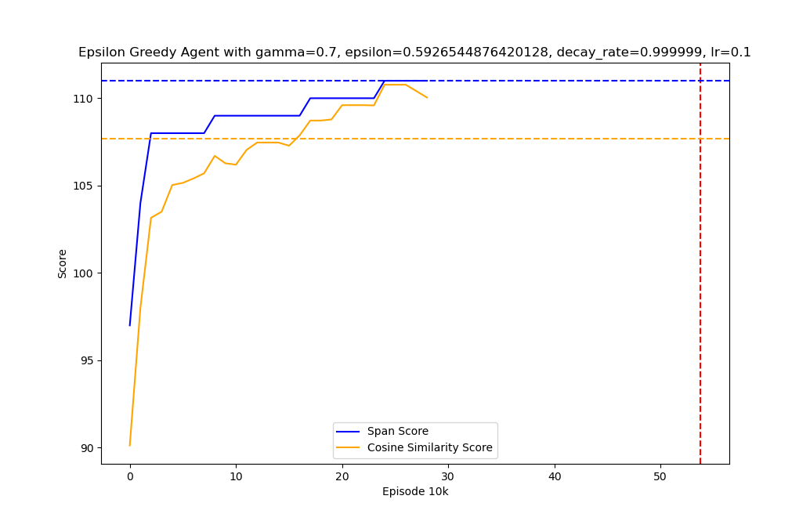
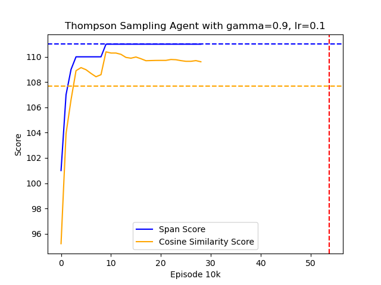
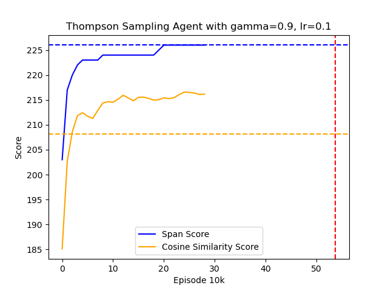

# Rapid Calibration of a Cellular-Resolution Bidirectional Neural Interface (RCCRBNI)

## Result
### 2022-11-28-1 dataset
Epsilon Greedy
<!-- insert plot here -->

Tompson Sampling

### 2022-11-04-2 dataset
Epsilon Greedy

Tompson Sampling

<!-- plot the histrogram of the nubmer of visit counts of each action -->
Best score for EpsilonGreedyAgent: 161206284.2
Best hyperparameters for EpsilonGreedyAgent: {'gamma': 0.9, 'epsilon': 0.6, 'decay_rate': 1, 'lr': 0.1}

Best score for DecayEpsilonGreedyAgent: 452423643.6666667
Best hyperparameters for DecayEpsilonGreedyAgent: {'gamma': 0.9, 'epsilon': 1.0, 'decay_rate': 0.99999, 'lr': 0.1}

Best score for UCB1Agent: 752782469.3333334
Best hyperparameters for UCB1Agent: {'gamma': 0.9, 'c': 1.0, 'lr': 0.1}
Best score for UCB1Agent: 742064040.3333334
Best hyperparameters for UCB1Agent: {'gamma': 0.9, 'c': 0.1, 'lr': 0.1}

Best score for SARSAAgent: 668298738.0
Best hyperparameters for SARSAAgent: {'gamma': 0.9, 'epsilon': 0.4, 'lr': 0.1}